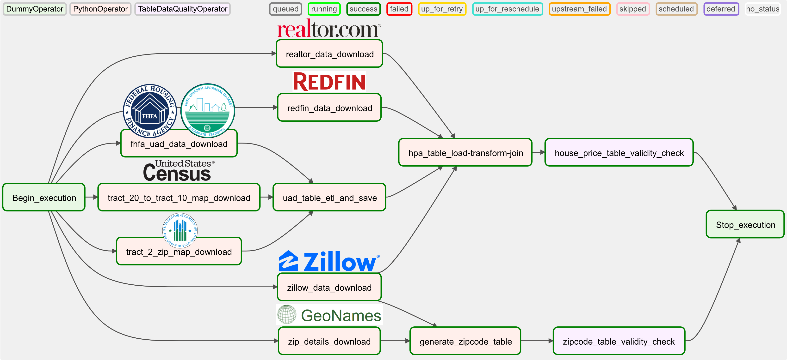

# US House Price Data Pipeline Airflow

This is an Airflow orchestration repo of US House Price Data Warehouse. The data warehouse is similar to the one described [here](https://github.com/Mahdi-Moosa/US_Housing_Price_ETL).

## Project goals & data source 

This Airflow orchasteration generates a Data Warehouse to perform analytics on US housing. The warehouse is designed to perform analytics based on zip codes. Data for the warehouse comes from five different sources:
1. FHFA appraisal data ([UAD Dataset](https://www.fhfa.gov/DataTools/Pages/UAD-Dashboards.aspx)).
2. [Realtor](https://www.realtor.com/research/data/) research data.
3. [Redfin](https://www.redfin.com/news/data-center/) research data.
4. [Zillow](https://www.zillow.com/research/data/) housing index.
5. Zip code data from [GeoNames](http://download.geonames.org/export/zip/).

*Additional data (for census tract to zipcode mapping) comes from [U.S. Census Bureau](https://www.census.gov/) and [U.S. Department of
Housing and Urban Development](https://www.hud.gov/).*

## Steps
* Step 1: Prepare appraisal data for zip code-based query (extract data from different sources, transform and join/merge).
* Step 2: Extract and transform realtor, redfin, zillow & zip code data.
* Step 3: Merge/ join transformed FHFA appraisal data, realtor data, redfin data and zillow data to prepare master house price dataset.
* Step 4: Prepare zip code dimension table.
* Step 5: Validate the master house price table & zipcode table for data integrity (using custom airflow operator).

*Notes: At present, the airflow orchestration saves data in pre-specified local directories. This can easily be reconfigured to store data in Amazon S3 bucket and/or Amazon Redshfit. Please see: https://github.com/Mahdi-Moosa/US_Housing_Price_ETL*

## Files/ folders in this repo: 
* dags: folder contains .py script to run the Apache Airflow DAG.
* docker-compose.yaml: docker-compose yaml file (for Apache Airflow; run in Windows 10 Pro, Docker Desktop). yaml file was modified to run in the aforementioned OS environment. 

## Data pipeline features:
* Downloads file from different data sources.
* Reads downloaded files (formats: csv, xlsx, tar.gz, zip and txt).
* By default, file(s) are only downloaded if they are not present already. Default args can be modified to ignore and replace existing files (if preferred).
* Performs ETL primarily using python pandas library.
* Staging table(s) and final data table(s) for US house price datawarehouse are saved as parquet format.
* DAG tasks are performed using PythonOperator(s). Data validation is done using a custom operator. 

## Graph view of the Airflow Tasks:

## How to run the the pipeline:
1. Install Apache Airflow. Official documentation: [*link*](https://airflow.apache.org/docs/apache-airflow/2.2.1/start/docker.html). My experiences with  installing Airflow in [Windows 10 Pro](https://mahdimoosa.substack.com/p/airflow-in-windows-10-pro-docker). 
2. Run airflow container.
3. Trigger the DAG.
